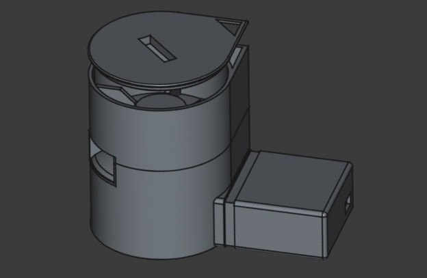

# automated-pet-feeder
**This is a small personal project running on a Raspberry Pi 1 to allow pet to get some treats while the owner is away.**

The device is made out of 3D printed parts (PLA for all of the container/frame and soft TPU for the rotor to be pet safe) and uses a Raspi 1 to control the feeder. Basicly it uses an old web camera (the slot on the lid is used for mounting it) and a stepper motor to spin a 4 bladed rotor 90 degrees per run, that pushes the treats out of the container, while livestreaming and recording it. The device can be monitored and controlled via a web interface. Due to the limitation of the Raspi 1 performance, the saved "video" of the stream is actually a flipbook of images running on a loop.



| Component | Pin Type | RPi Physical Pin | GPIO Number (BCM) |
| :--- | :--- | :--- | :--- |
| **Motor IN1** | Output | Pin 7 | GPIO 4 |
| **Motor IN2** | Output | Pin 11 | GPIO 17 |
| **Motor IN3** | Output | Pin 13 | GPIO 27 |
| **Motor IN4** | Output | Pin 15 | GPIO 22 |
| **LED Transistor Base** | Output | Pin 12 | GPIO 18 (via 1k resistor) |
| **Common Ground** | GND | Pin 6, 9, or 14 | GND |
| **Driver/LED Power** | 5V | Pin 2 or 4 | 5V |

## Setup

Here is a template for my personal setup with this, modify to fit your timezone and paths.

1. Set timezone
`sudo timedatectl set-timezone Europe/Helsinki`

2. Create systemd service
`sudo nano /etc/systemd/system/petfeeder.service`

3. Add the following content to the service file:
```bash
[Unit]
Description=Pet Feeder Controller
After=network.target
[Service]
ExecStart=/usr/bin/python3 /home/user/pet_feeder/controller.py
WorkingDirectory=/home/user/pet_feeder
User=user
Restart=always
RestartSec=5
[Install]
WantedBy=multi-user.target
```

4. Reload systemd and enable the service
`sudo systemctl daemon-reload`
`sudo systemctl enable petfeeder.service`
`sudo systemctl start petfeeder.service`

5. Check status
`sudo systemctl status petfeeder.service`

6. Make feed.sh executable
`chmod +x /home/user/pet_feeder/feed.sh`

7. Add cron job
`crontab -e`

8. Add the following content to the cron job:
```bash
0 18 * * * /home/user/pet_feeder/feed.sh >> /home/user/pet_feeder/scheduled_feeds.log 2>&1
```

9. All set up! The feeder should now run as a service automatically on startup, accessible via your local or public IP and port 8000 (depends on your setup) and the scheduled feed will be triggered at 6 PM every day by default.